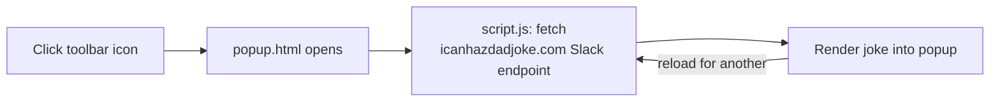

# Witticismdo

> Browser extension that shows a random dad joke every time you click the toolbar icon.

[](./LICENSE)
[](https://github.com/chirag127/Witticismdo/stargazers)
[](https://github.com/chirag127/Witticismdo/commits/main)

[](https://witticismdo.oriz.in)

**Live:** https://witticismdo.oriz.in

## What it is / why it exists

Click the toolbar icon and Witticismdo pops up a fresh dad joke, fetched live from
[icanhazdadjoke.com](https://icanhazdadjoke.com/). It exists to prove a useful, delightful
browser extension needs no build step, no dependencies, and no backend — just a fetch and a
sprinkle of HTML. Pin it for one-click laughs.

## Links

- **Live page (canonical):** https://witticismdo.oriz.in
- **Repository:** https://github.com/chirag127/Witticismdo
- **GitHub Pages:** https://chirag127.github.io/Witticismdo/ — the Cloudflare domain is the
  canonical live site; GitHub Pages serves the repo landing/about.

## ⭐ Star this repo

If this is useful, please ⭐ star the repo — it helps others find it.

## How it works



## Install

> **Store status:** Load unpacked / Kiwi zip install; no Web Store listing.

### Chrome / Edge (desktop)

1. Download this repo as a [ZIP](https://github.com/chirag127/Witticismdo/archive/refs/heads/main.zip) and unzip it.
2. Open `chrome://extensions` (or `edge://extensions`).
3. Enable **Developer mode**.
4. Click **Load unpacked** and select the unzipped folder.
5. Pin the extension, then click it for a joke.

### Mobile (Kiwi Browser)

1. Install [Kiwi Browser](https://play.google.com/store/apps/details?id=com.kiwibrowser.browser).
2. Go to `kiwi://extensions/`.
3. Enable **Developer mode**.
4. Choose **Install from zip** and pick the downloaded ZIP.

### Use as a plain web page

1. Unzip the folder and open `popup.html` in any browser.
2. Reload the page for a new joke.

## Features

- One fresh dad joke per toolbar click
- Live fetch from icanhazdadjoke.com — always a new joke, nothing bundled
- No build step, no dependencies, no backend
- Works as an extension **or** as a standalone web page
- Runs on desktop Chrome/Edge and mobile via Kiwi Browser

## Tech stack

- **HTML / CSS / vanilla JavaScript**
- **Manifest V2**
- **icanhazdadjoke.com** Slack endpoint (live joke source)

## Repo structure

```
Witticismdo/
├── manifest.json     Manifest V2 config
├── popup.html        popup UI (also usable as a standalone page)
├── script.js         fetches a joke and renders it
├── style.css         popup styling
├── logo.png          icon
├── docs/             live site (CNAME witticismdo.oriz.in)
└── LICENSE           MIT
```

## Part of the oriz family

Witticismdo is one of ~80 sites and tools in the **oriz** family. Explore the rest at
[blog.oriz.in](https://blog.oriz.in). The docs/landing site is **$0 on the Cloudflare free tier**.

## Contributing

Issues and PRs welcome. Conventional commits are the changelog.

## License

MIT — see [LICENSE](./LICENSE).

## Author

**Chirag Singhal** — chirag@oriz.in

## Status / roadmap

Working and stable. Possible next: offline joke cache and a keyboard shortcut.
